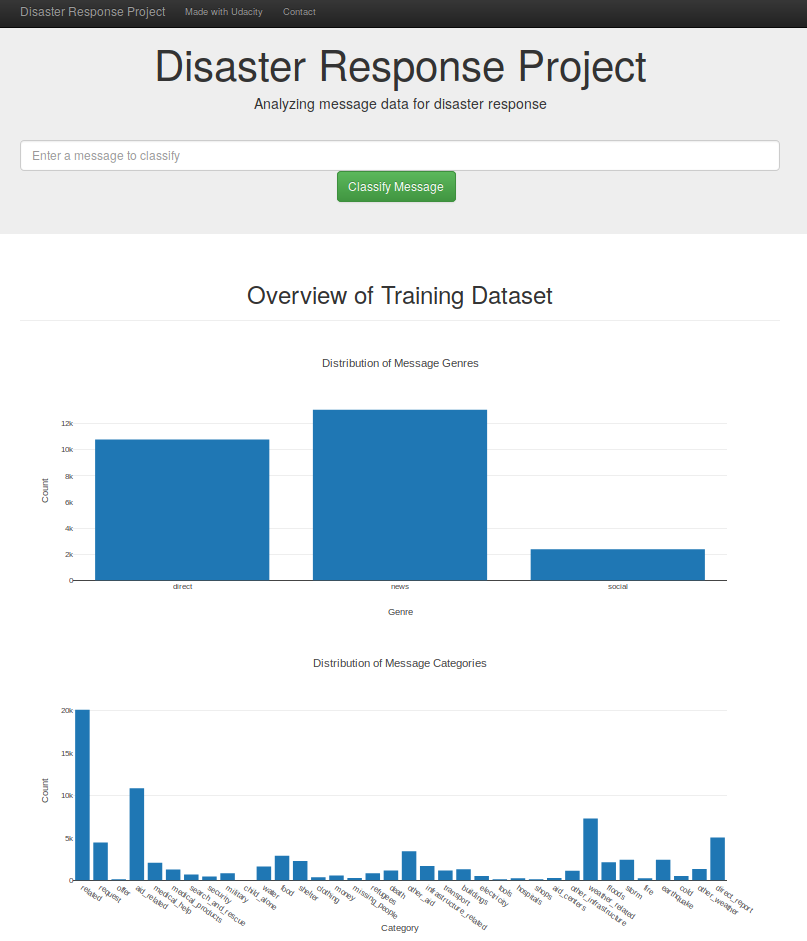
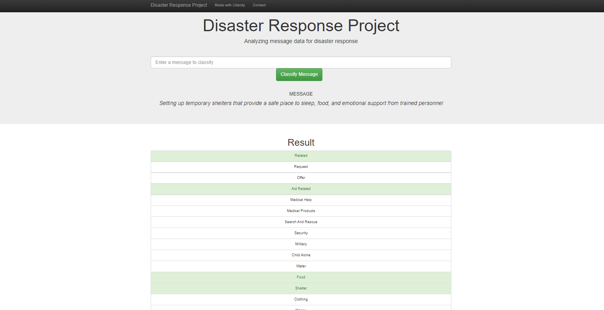

# Disaster Response Pipeline Project


## Table of Contents
1. [Description](#description)
2. [Getting Started](#getting_started)
	1. [Dependencies](#dependencies)
	2. [Installing](#installing)
	3. [Executing Program](#executing)
3. [Authors](#authors)
4. [License](#license)
5. [Acknowledgement](#acknowledgement)
6. [Screenshots](#screenshots)

<a name="descripton"></a>
## Description

This Project is part of Data Science Nanodegree Program by Udacity in collaboration with Figure Eight.
The initial dataset contains pre-labelled tweet and messages from real-life disaster. There are 36 pre-defined categories, and examples of these categories include Aid Related, Medical Help, Search And Rescue, etc. By classifying these messages, we can allow these messages to be sent to the appropriate disaster relief agency. This project will involve the building of a basic ETL and Machine Learning pipeline to facilitate the task. 
The aim of the project is to build a Natural Language Processing model to categorize messages in real-time basis.


The Project is divided in the following Sections:

1. Data Processing, ETL Pipeline to extract data from source, clean data and save them in a proper databse structure
2. Machine Learning Pipeline to train a model able to classify text message in categories
3. Web App to show model results in real time. 

## Files

          |-- app
                |-- templates
                        |-- go.html # main page of web app
                        |-- master.html # classification result page of web app
                |-- run.py # Flask file that runs app
          |-- data                
                |-- DisasterResponse.db # database to save clean data to
                |-- categories.csv # data to process 
                |-- disaster_message.csv # data to process
                |-- process_data.py
          |-- models
                |-- classifier.rar (classifier.pkl) # saved model 
                |-- train_classifier.py
          |-- image
	  	|-- intro.png
		|-- main_page.png
          |-- README
	  |-- License

<a name="getting_started"></a>
## Getting Started

<a name="dependencies"></a>
### Dependencies
* Python 3.5+ (I used Python 3.7)
* Machine Learning Libraries: NumPy, SciPy, Pandas, Sciki-Learn
* Natural Language Process Libraries: NLTK
* SQLlite Database Libraqries: SQLalchemy
* Web App and Data Visualization: Flask, Plotly

<a name="installing"></a>
### Installing
Clone this GIT repository:
```
git clone https://github.com/kokobiyu/Disaster-Response-Pipeline.git
```
<a name="executing"></a>
### Executing Program:
1. Run the following commands in the project's root directory to set up your database and model.

    - To run ETL pipeline that cleans data and stores in database
        `python data/process_data.py data/disaster_messages.csv data/categories.csv data/DisasterResponse.db`
    - To run ML pipeline that trains classifier and saves
        `python models/train_classifier.py data/DisasterResponse.db models/classifier.pkl`

2. Run the following command in the app's directory to run your web app.
    `python run.py`

3. Go to http://0.0.0.0:3000/

<a name="authors"></a>
## Authors

* [kokobiyu](https://github.com/kokobiyu)

<a name="license"></a>
## License
[](https://opensource.org/licenses/MIT)

<a name="acknowledgement"></a>
## Acknowledgements

* [Udacity](https://www.udacity.com/) for providing such a complete Data Science Nanodegree Program
* [Figure Eight](https://www.figure-eight.com/) for providing messages dataset to train my model

<a name="screenshots"></a>
## Screenshot

The main page shows some graphs about training dataset, provided by Figure Eight



Enter the message and then click on 'Classify Message' button. This is the example of the result


